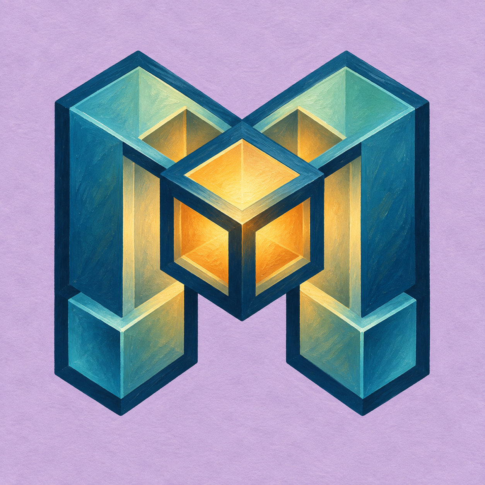
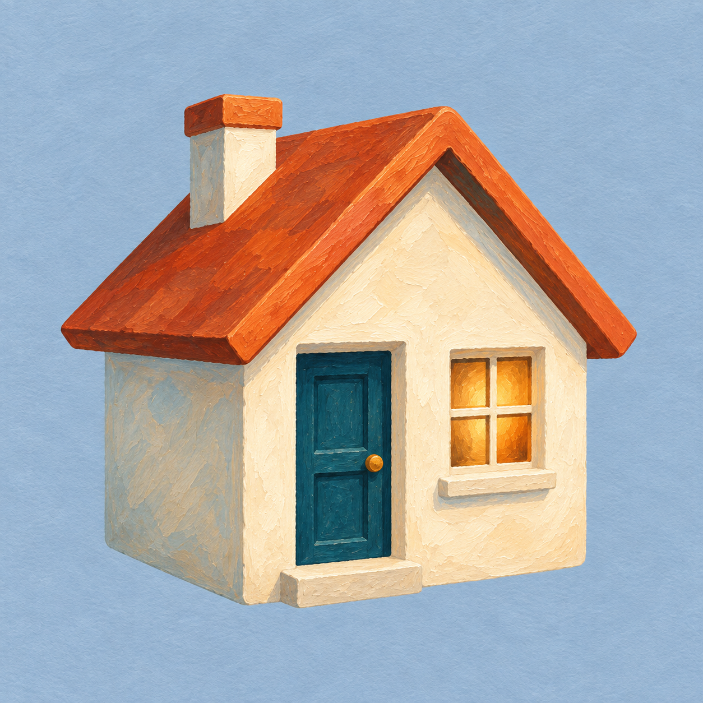
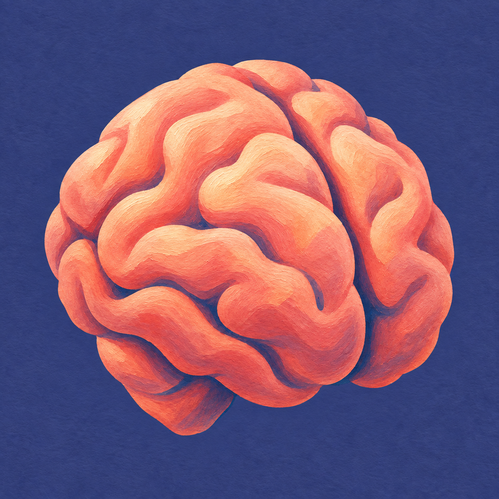

# Painted agent avatars

<p align="center">
  <a href="reference.png"></a>
</p>

23 stock avatars for common assistant roles. Each uses a recognizable object or mark, a distinct background color, and a warm painted texture. Choose any image for any agent; the suggested roles are starting points.

## Gallery

Click an image to open its PNG.

| | | | |
| :---: | :---: | :---: | :---: |
| [](agents/analyst.png)<br>**Analysis** | [](agents/code.png)<br>**Coding** | [](agents/general.png)<br>**General chat** | [](agents/research.png)<br>**Research** |
| [](agents/summary.png)<br>**Summaries** | [](agents/helper.png)<br>**Helper** | [](agents/computer.png)<br>**Computer** | [](agents/calculator.png)<br>**Maths** |
| [](agents/phone.png)<br>**Calls** | [](agents/data.png)<br>**Data** | [](agents/email.png)<br>**Email** | [](agents/finance.png)<br>**Finance** |
| [](agents/home.png)<br>**Home** | [](agents/news.png)<br>**News** | [](agents/security.png)<br>**Security** | [](agents/shell.png)<br>**Shell** |
| [](agents/storyteller.png)<br>**Storytelling** | [](agents/writer.png)<br>**Writing** | [](agents/planner.png)<br>**Planning** | [](agents/builder.png)<br>**Agent building** |
| [](agents/router.png)<br>**Router** | [](agents/mind.png)<br>**Mind** | [](agents/mind-logo.png)<br>**Mind (logo)** | |

## Files and suggested roles

| File | Suggested role |
| --- | --- |
| [`analyst.png`](agents/analyst.png) | Provides analytical insights and balanced, evidence-based recommendations. |
| [`code.png`](agents/code.png) | Builds software, solves coding problems, and works with files. |
| [`general.png`](agents/general.png) | Provides friendly, helpful general conversation and assistance. |
| [`research.png`](agents/research.png) | Finds and cross-checks knowledge from web, reference and academic sources. |
| [`summary.png`](agents/summary.png) | Condenses long documents into their key information. |
| [`helper.png`](agents/helper.png) | Helps with everyday tasks and finding the next step. |
| [`computer.png`](agents/computer.png) | Helps people use computers and desktop applications. |
| [`calculator.png`](agents/calculator.png) | Solves arithmetic and explains mathematical ideas. |
| [`phone.png`](agents/phone.png) | Handles calls and short voice communications. |
| [`data.png`](agents/data.png) | Explores datasets and communicates patterns. |
| [`email.png`](agents/email.png) | Organizes messages and drafts email replies. |
| [`finance.png`](agents/finance.png) | Helps examine budgets and financial information. |
| [`home.png`](agents/home.png) | Helps manage a smart home and everyday household tasks. |
| [`news.png`](agents/news.png) | Finds news and reports the key developments. |
| [`security.png`](agents/security.png) | Explains security risks and helps protect systems. |
| [`shell.png`](agents/shell.png) | Helps operate terminals, files and system tools. |
| [`storyteller.png`](agents/storyteller.png) | Tells warm imaginative bedtime stories. |
| [`writer.png`](agents/writer.png) | Drafts and edits clear thoughtful prose. |
| [`planner.png`](agents/planner.png) | Organizes tasks, schedules and next steps. |
| [`builder.png`](agents/builder.png) | Helps create and configure new agents. |
| [`router.png`](agents/router.png) | Routes each request to the most suitable agent. |
| [`mind.png`](agents/mind.png) | Acts as the main thinking companion and personal assistant. |
| [`mind-logo.png`](agents/mind-logo.png) | An alternative for the main companion, using the painted MindRoom logo. |

## Use

Download an image from `agents/` and use it as an agent profile picture. The files are square PNGs with opaque backgrounds. Keep the whole square when uploading; clients may display a circular crop. Check the result at the size used by your client.

For a MindRoom setup that uses the standard `avatars/agents/` directory, copy the chosen image there with the agent's configured name, for example `avatars/agents/general.png`. These files do not change the agent's behavior or tools.

The optional [`mind-logo.png`](agents/mind-logo.png) reuses `reference.png` unchanged. To choose it for a MindRoom agent named `mind`, install it as `avatars/agents/mind.png`. Its saved prompt asks regeneration to preserve the logo's shape.

## Style and future additions

The set was generated with OpenAI's built-in image generation tool. [prompts.json](prompts.json) records each role, subject, background color, and full prompt. [reference.png](reference.png) is the MindRoom painting reference supplied with every request.

To add an avatar, add an entry to the prompt catalog following the same structure. Use one clear object, broad shapes, a contrasting background, and enough margin for a circular crop. Inspect the result at 40 and 80 pixels before selecting it. Regeneration can match the style but will not reproduce identical pixels.

## Regenerate avatars

[generate.py](generate.py) reads the saved prompts and supplies the painting reference with every request to the [OpenAI image editing API](https://developers.openai.com/api/docs/guides/image-generation). It defaults to [GPT Image 2.5 Sunburst](https://developers.openai.com/api/docs/models/gpt-image-2.5-sunburst), high quality, and 1024×1024 PNG output. The original collection was generated with the built-in image tool; this script provides an API-based way to generate new versions.

Install [uv](https://docs.astral.sh/uv/getting-started/installation/), then run these commands from the repository root. `uv` installs the script's dependencies automatically.

```sh
# Preview the full set without an API key, requests, or file writes.
uv run avatars/painted/generate.py --dry-run

# Generate two avatars after setting your API credential.
uv run avatars/painted/generate.py router mind
```

Set `OPENAI_API_KEY` in your environment, or set `OPENAI_API_KEY_FILE` to a file containing the key. Generation makes paid OpenAI API requests and requires access to the selected model.

Omit the names to generate the whole set. Results go into the ignored `avatars/painted/generated/` directory; use `--output-dir` to choose another directory. Existing output files are skipped unless you pass `--force`. Use `--model` to select a different model or pin a snapshot. Review the new images before copying selected files into `agents/`.

Normal runs require an output filesystem that supports hard links, checked before any paid request. If that check fails, choose another output directory or use `--force`, which does not require hard links but replaces existing output for selected avatars.

The script sends each full saved prompt verbatim with `reference.png`, generates each avatar separately, and validates the returned PNG before saving it atomically. Failed writes preserve existing images and leave no partial avatar to skip on a later run. An error stops the run with a nonzero exit status; completed files remain available and are skipped on the next run.

Run the offline tests without API credentials:

```sh
uv run --with 'openai>=2.54,<3' --with 'pillow>=11,<13' \
  python -m unittest discover -s avatars/painted -p test_generate.py -v
```
